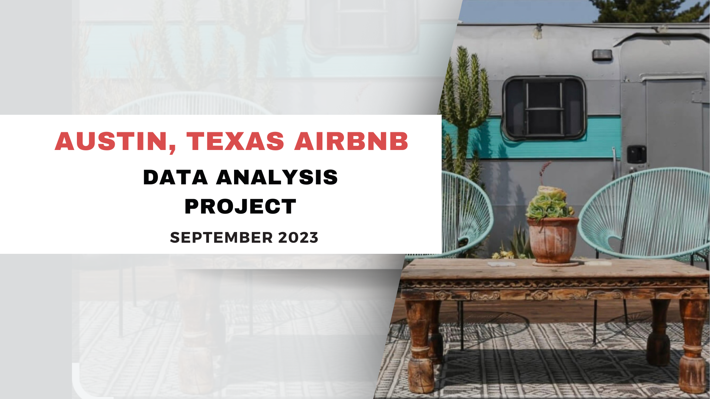
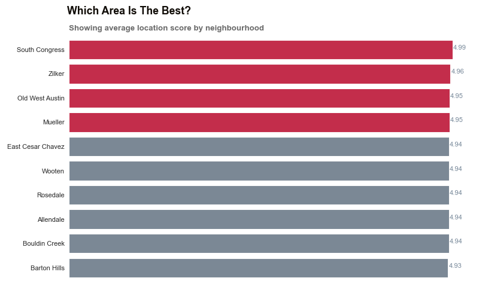
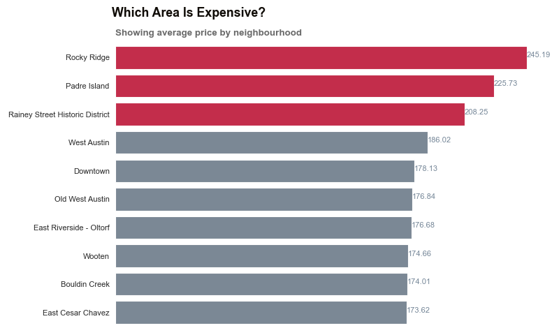
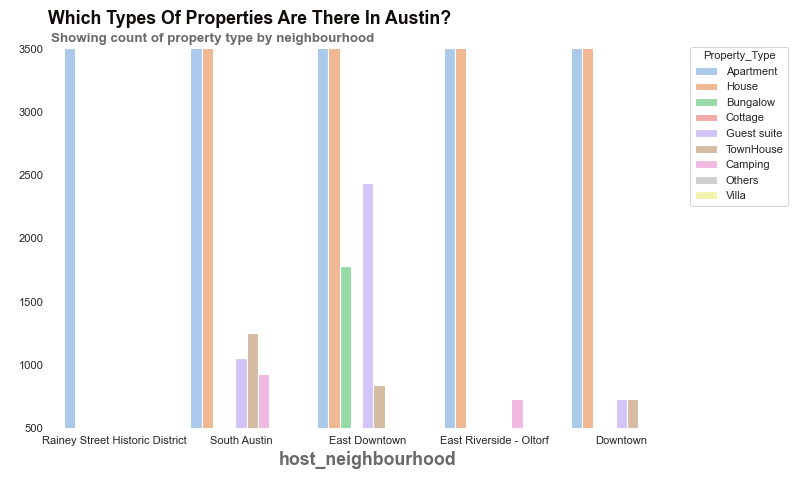

---

### Following are a few questions that we aim to answer through our analysis:
1. How do prices of listings vary by neighbourhood? 
2. What are the best type of property in Austin? Do they vary by neighborhood?
3. How does the demand for Airbnb rentals differ across the year and over years?
4. What amenities in Austin are rated highly by guest? 
5. What makes a host super host ? 
6. Are there any common themes that can be identified from the free-text section of the reviews? what aspects of the 
rental do people like and dislike? 

------
  
### A quick glance at the data shows that there are:

* 2685 unique listing in Austin, Texas in total. The first rental in Texas was up in 
August 2008 in McKinney. 

* Over 514921 reviews have been written by guests. 
* The price for listing ranges from $5 per night to $10000 per night. Listing with 
$10000 price tag are in Windsor Park and East Cesar Chavez.

### Analysis of Data Quality 
1. price : The price column contained data in string format with the currency 
symbol "$" and comma separator attached to it.
2. date: We transformed the host_since to datetime format. 
3. Dealing with missing values : The data also had null values. 

         Listings null data percentage:

         listing_id                 0.0
         date                       0.0
         price                      0.0
         host_since                 0.0
         host_neighbourhood        16.0
         review_scores_location    30.0
         latitude                   0.0
         longitude                  0.0
         number_of_reviews          0.0
         amenities                  0.0
         host_is_superhost         21.0
         property_type              0.0
         room_type                  0.0

---------------------
# Exploratory Data Analysis 

We will detail our analysis to answer the questions of interest through exploratory data analysis
and visualization. we will use :

  * Spatial Data Analysis
  * Demand and price analysis
  * User Review mining
  * Other interesting insights
  
--------------

## Spatial Data Analysis
We will explore various variables using Tableau, we will answer questions 
in prices and ratings across different neighbourhood in Austin.

--------------

      Airbnb customer's rate their stay on the basis of location, 
      cleanliness and a host of other parameters. 
      Here we work with the location score. 
      High rated neighbourhood will tend to be closer to 
      the city hotspots, will tend to fulfill the customer interest.

-------------

------------

------------

# Demand and Price Analysis

