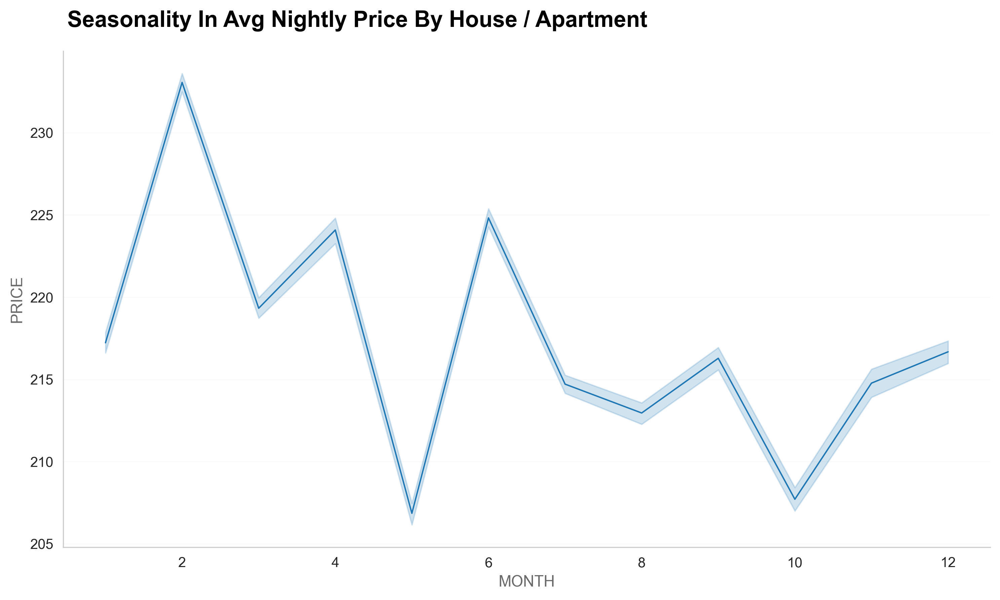
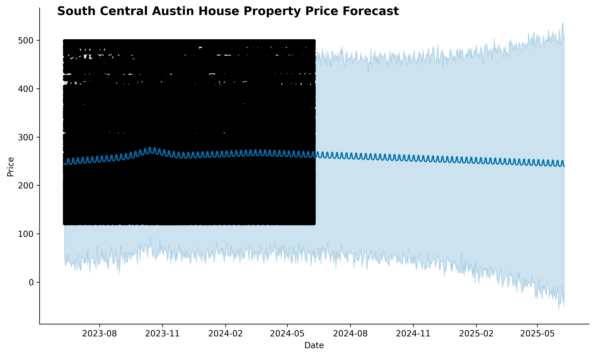
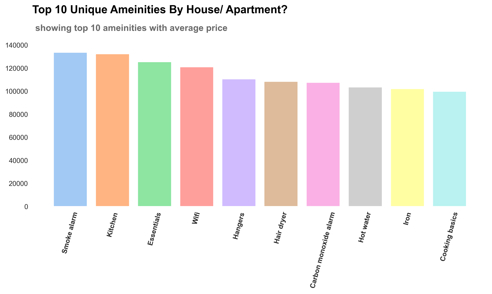

---

### Following are the roadmap that we aim to answer through our analysis:

1. How do the ratings of listings vary.

                 
2. Find what populations rent in each area and what type of property they rent.
      
         
3. Trends of people entering Airbnb market and leaving Airbnb market in areas of interest.

         
4. Price, seasonality of property, and price forecast.
     
         
------
  
### A quick glance at the data shows that there are:

______

______

______

* 10150 number of listing in Austin with positive score > 0.05. The first rental in Texas was up in 
March 2008 in McKinney. 

* Over 545633 reviews have been written by guests. 
* The average price for listing ranges from $10 per night to $10000 per night. Listing with 
$10000 price tag are in Windsor Park, Northeast Austin.

### Analysis of Data Quality 
1. Price : The price column contained data in string format with the currency 
symbol "$" and comma separator attached to it.
2. Date: We transformed the host_since and date columns to datetime format.
3. Dealing with missing values : The data also had null values to preserve all the information, 
we imputed or dropped the rows containing null values. 
4. Imputed : we fixed some wrong entry in the host_neighbourhood column,
   moreover, we segment the property type, the zipcode and the price columns. 

         

---------------------

# Exploratory Data Analysis 

We will detail our analysis to answer the questions of interest through exploratory data analysis
and visualization. we will use :
  * Hypothesis Testing 
  * Sentiment Analysis
  * Spatial Data Analysis
  * Demand and price analysis
  * Textual data mining
  * Other interesting insights
  
_______

# Hypothesis Testing 

______________

      Test i: 
      If there is a significant difference in the avg nightly price between 
      properties located in downtown and those in East Austin? 
      
      Our Case:
            H0 : avg nightly price DT = avg nightly price ET 
        
            Ha : avg nightly price DT != avg nightly price ET 
      
                  
      we performed the T-test and the result of the p-value: 
      P-Value = 8.85715622564
      α = 0.05
      
      Test i:
      if p-value <= a ---> reject H0
      if p-value > a  ---> dont reject H0
      
      result of the test: 
      p-value is greater than alpha(0.05) we fail to reject the null hypothesis,  suggesting there is
      significant difference in avergae nightly price between DT and ET. 

---

      Test ii:      
      Is there a relationship between special amenities and property types in an Airbnb dataset?
            
            Our Case:
            H0 : property type  =(Significant) aminities 
        
            Ha : property type !=(No Significant) aminities
      
            
      Test ii:
      if p-value <= a ---> reject H0
      if p-value > a  ---> dont reject H0
      
      We Perform the Chi-Squared Test
      P-Value = 0.0
      α = 0.05

      result of the test: 
      p-value is less than alpha(0.05) we reject the null hypothesis,
      suggesting there is no significant difference.

---
      Test iii : 
      If there is a significant difference in the avg nightly price between 
      super host and not a super host? 
      
      Our Case:
            H0 :  super host =  signifiant on price  
        
            Ha : not super host  != (No Significant) price 
      
                  
      we performed the T-test and the result of the p-value: 
      P-Value = 0.0
      α = 0.05
      
      Test iii:
      if p-value <= a ---> reject H0
      if p-value > a  ---> dont reject H0
      
      result of the test: 
      p-value is less than alpha(0.05) we reject the null hypothesis,  suggesting there is no
      significant difference in avergae nightly price between super host and not a super host. 

## Spatial Data Analysis

This section will explore various variables from our dataset to answer questions relating 
to prices property types and  locations in Austin, in addition to prove 
our hypothesis test.

--------------

--------------

      The graph follows our previous location ratings by neighbourhood.
      Showing South Central is the most expensice location followed by East Austin
      Now its obvious that the highly rated location
      would also tend to be costly. 
      
        

-------------

# Price Analysis & Forecast
         

------------

------------

____________

-----------

___________

      As we can see , Friday and Saturday are more expensive compared to 
      the other days of the week, perhaps due to higher demand for lodging.
----
# Textual Data Mining 
______

______

______

## NLP  

______

_____

_____

---------

## Other interesting insights

__________

---------

## Executive Summary: Airbnb Data Analysis

_________

*Key Findings*:

1. *High Demand Periods*: Our analysis revealed that the months of Feb to April experienced the highest demand, 
    with a noticeable peak in March. 

2. *Pricing Trends*: We observed that pricing varies significantly by neighborhood,
with Central Austin listings the highest nightly rates. 
Seasonal patterns also influence pricing, with rates inclement during peak tourist seasons.

3. *Guest Preferences*: Guests predominantly book entire homes or apartments, 
and the most frequently cited reasons for travel were vacations and leisure trips.
This suggests an opportunity to tailor listings and amenities to these preferences.

*Amenities and Reviews:*
4. *Amenities Analysis*: Amenities such as Kitchen, smoked alarm, essentials, WI-FI and hairdryer  were highly prevalent. 
listings offering unique features like free parking lot
stood out and often commanded higher prices.

5. *Review Sentiments*: Sentiment analysis of guest reviews indicated that location, comfortable, and neighborhood 
were critical factors influencing overall guest satisfaction. 
Listings with consistently positive reviews tended to perform well.

*Recommendations:*

6. *Pricing Strategy*: Hosts should consider dynamic pricing strategies to 
maximize revenue during peak demand periods while remaining competitive during off-peak times.

7. *Amenity Enhancements*: Hosts can invest in standout amenities that align with guest preferences
to increase listing desirability.

8. *Superhost Status*: Aspiring hosts should aim to meet the criteria for
Superhost status, as it positively impacts bookings and reputation.

 
